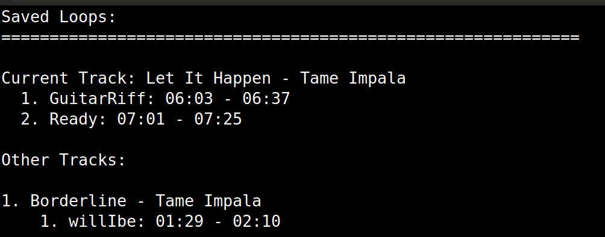
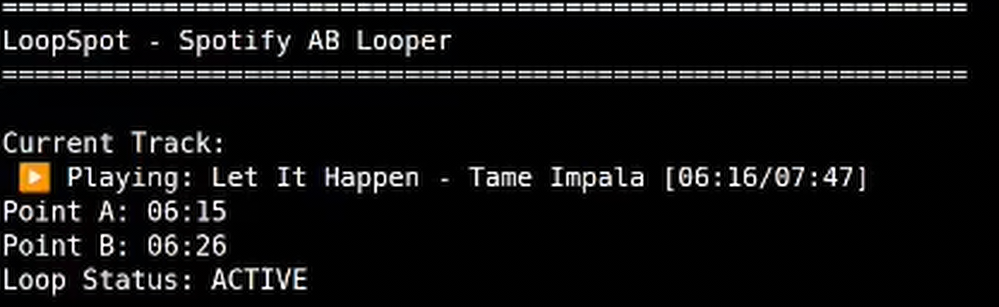

# LoopSpot - Spotify AB Looper

A command-line application that allows setting A/B loop points for Spotify tracks, enabling seamless practice or focused listening of specific parts of songs.

## Quick Start

### Download
- Get the latest release from [Releases](https://github.com/hossamsaberx/loopspot/releases)
- Windows: Download `LoopSpot.exe`
- Linux: Download `LoopSpot` binary

### Run
1. Create a dedicated folder (e.g., `~/LoopSpot` or `/opt/loopspot`)
2. Place the executable in the folder
3. Run the application:
   - Windows: Double-click `LoopSpot.exe`
   - Linux: `chmod +x LoopSpot && ./LoopSpot`

## Features

- Set loop points A and B at current playback positions
- Manually enter custom timestamps for precise loop points
- Automatically loop between points A and B during playback
- Save and load loop points for your favorite tracks
- Simple command-line interface

## Screenshots and Demo

### Screenshots



*The LoopSpot command-line interface showing saved loops for Tame Impala tracks.*

### Video Demo

[](https://youtu.be/wzKtVWIY1qw)

*Click the image above to watch a demonstration of LoopSpot in action with audio.*

## Requirements

- **Spotify Premium account** (required for seeking functionality)
- Active Spotify playback on any device

## Development Setup

1. Clone and install:
   ```bash
   git clone https://github.com/hossamsaberx/loopspot.git
   cd loopspot
   pip install -r requirements.txt
   ```

2. Set up Spotify Developer credentials:
   - Go to [Spotify Developer Dashboard](https://developer.spotify.com/dashboard)
   - Create new app with redirect URI: `http://127.0.0.1:8888/`
   - Copy Client ID and Secret

3. Run the application:
   ```bash
   python run.py
   ```

## Commands

- **1**: Set point A (current position)
- **2**: Set point B (current position)
- **3**: Set point A (manual timestamp)
- **4**: Set point B (manual timestamp)
- **5**: Start loop
- **6**: Stop loop
- **7**: Save current loop
- **8**: List saved loops
- **9**: Load a saved loop
- **10**: Delete a saved loop
- **11**: Refresh current track
- **12**: Reset Spotify credentials
- **0**: Exit

## Contributing

Contributions are welcome! Feel free to:
1. Fork the repository
2. Create a branch
3. Submit a pull request

## License

[MIT License](LICENSE)

## Contact

For questions, support or bugs, please open an issue in the GitHub repository.